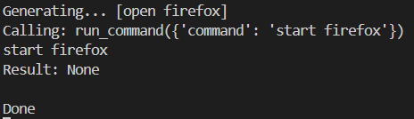
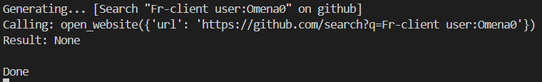

# typing.ai

Your day-to-day AI assistant

## Features:

Custom command support for when waiting for an AI to respond is too slow
(See: src/commands.py)

AI assistant capable of a multititude of tasks such as:

- Opening applications
- Closing them
- Searching on google
- Writing text
- Running commands
- Evaluating code
- Easily expandable commands

All run locally, works offline

Customizable model and hotkey

## Examples:

### Opening applications

### Github Search

## Slick UI

## Simple and fast

# HOW TO SET UP

1. Clone repo
2. Install ollama
3. Install the ai model [`ollama pull deepseek-r1`]
4. Download & run dist/typing.ai_main.exe
5. Default hotkey is caps lock (change in config.ini)
