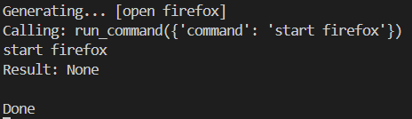

# typing.ai

Your day-to-day AI assistant

## Examples:

### Opening applications

### Github Search

## Slick UI

## Simple and fast

# HOW TO SETUP

1. Clone repo
2. Install ollama and python
3. Install requirments.txt
4. Install the ai model [`ollama pull krtkygpta/gemma2_tools`]
5. Run main.py
6. Default hotkey is TAB (first query will take a bit to load)
